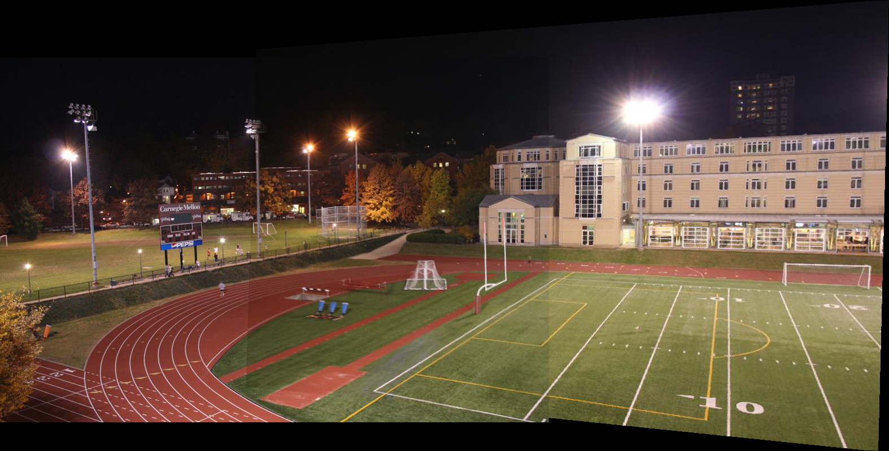
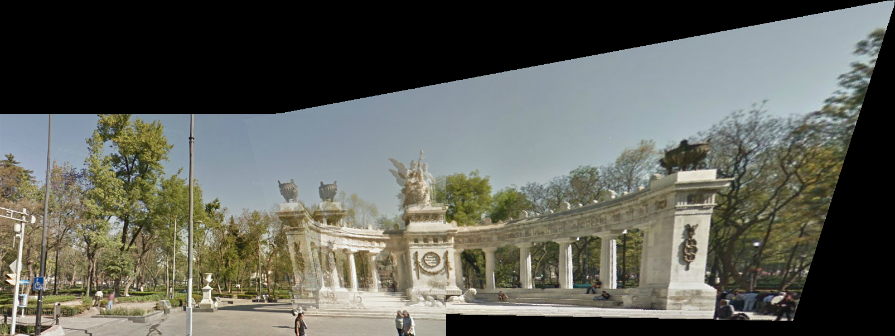

# Image stitching using Random Sample Consensus (RANSAC) and SIFT features.

This example demonstrates how to use SIFT features and Homography to stitch multiple images.
This method can be used as panaroma stitching.

```d
import mir.ndslice;
import mir.rc;

import dcv.core;
import dcv.features : SIFTKeypoint, find_SIFTKeypointsAndDescriptors, find_MatchingPointsBruteForce;
import dcv.imgproc;
import dcv.imageio;
import dcv.plot;

import std.container.array : Array;
import std.stdio;
import std.math;
import std.range;
import std.typecons;

import dcv.linalg.homography;

string[2] image_paths = ["../data/stitching/im89.jpg", "../data/stitching/im90.jpg"];
//string[2] image_paths = ["../data/stitching/left.png", "../data/stitching/right.png"];

@nogc nothrow:

void main()
{
    double nndr_threshold=0.5;
    // early stop criteria for RANSAC iteration to speed up.
    // lower values for faster computation, higher values for accuracy
    double inlier_ratio_threshold = 0.8;
    size_t min_points=10;
    size_t req_points=20;
    size_t gn_iters=100;
    size_t max_iters=1000;
    double ransac_threshold=3;
    size_t estimation_iters=1;

    // this examples uses only 2 images to stitch. In theory, more can be stitched.
    Array!(Slice!(RCI!ubyte, 3)) images;
    Array!(Array!SIFTKeypoint) sift_keypoints;

    foreach(i, path; image_paths){

        // read images from disk
        auto image = imread(path);
        images ~= image.sliced.rcslice; // because we are in a loop body just make a refcounted copy and append it to the vector

        printf("    Computing SIFT features...[%lld]\n", i);
        // Detect keypoints and compute descriptors for a image and add it to a vector
        Array!SIFTKeypoint sift_keypoints_i = find_SIFTKeypointsAndDescriptors(images.back);
        
        sift_keypoints ~= sift_keypoints_i;
        destroyFree(image); // free the instance of Image
    }

    Slice!(RCI!ubyte, 3) _out = images[0];

    Array!(Slice!(RCI!double, 2)) homographyMatrices;

    int r_shift = 0;
    int c_shift = 0;

    foreach(i; 0..images.length -1)
    {
        printf("    Finding feature match points... [%lld]\n", i);
        // Match the descriptors using brute-force matching
        auto matches = find_MatchingPointsBruteForce(sift_keypoints[i+1], sift_keypoints[i], nndr_threshold);

        printf("    Estimating the homography matrix between %lld and %lld\n", i+1, i);
        // Estimate the homography matrix using RANSAC
        auto rtup = estimateHomographyRANSAC(sift_keypoints[i+1], sift_keypoints[i], matches, inlier_ratio_threshold,
            min_points, req_points, gn_iters, max_iters, ransac_threshold);

        auto H_i = rtup[0];

        homographyMatrices ~= H_i;

        printf("    Stitcing images... [%lld]\n", i);

        // stitch the images based on the computed homography using perspective transform implicitly
        auto stup = stitch(images[i+1], _out, homographyMatrices, r_shift, c_shift, estimation_iters);
        _out = stup[0];
        r_shift = stup[1];
        c_shift = stup[2];
    }
    
    // write the result on disk
    imwrite(_out, ImageFormat.IF_RGB, "result_stitched1.png");

    // display the stitched image
    imshow(_out);
    
    waitKey();
}
```

## Results




