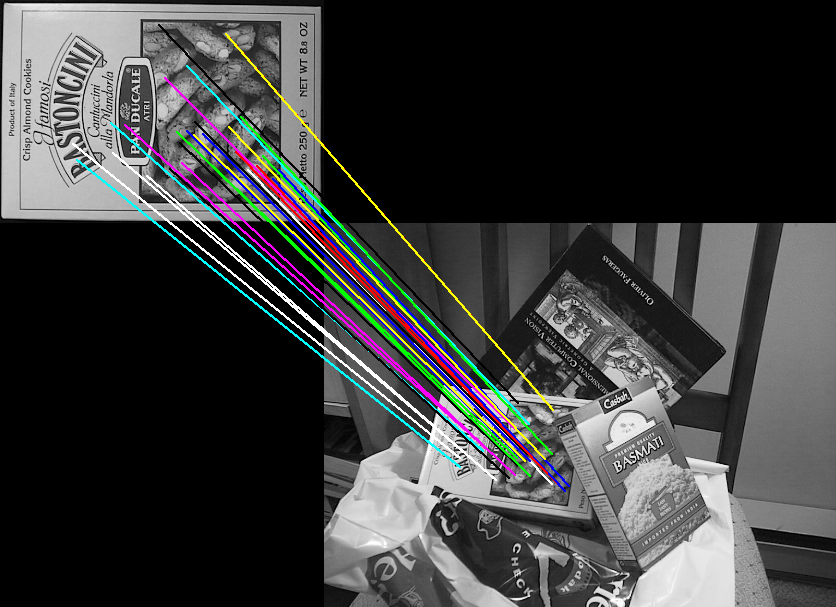

# Scale-invariant feature transform (SIFT)

This example should demonstrate how to use SIFT to detect matching points in two images. 

```d
import mir.ndslice;
import mir.rc;

import dcv.core;
import dcv.imgproc;
import dcv.imageio;
import dcv.plot;
import dcv.features.sift;


// https://github.com/dbarac/sift-cpp/blob/b54827526c6b6bfa71a714950f4654e6ea7ba491/src/sift.cpp

@nogc nothrow:

void main()
{
    // read two images to match potential keypoints
    auto image1 = imread("../data/matching/box.png");
    auto image2 = imread("../data/matching/box_in_scene.png");
    scope(exit){ // only class Image requires an explicit free in DCV.
        destroyFree(image1);
        destroyFree(image2);
    }
    
    // a SIFT keypoint contains both coordinates and a descriptor vector ubyte[128]
    // First compute them for both images
    Array!SIFTKeypoint keypoints1 = find_sift_keypoints_and_descriptors(image1.sliced);
    Array!SIFTKeypoint keypoints2 = find_sift_keypoints_and_descriptors(image2.sliced);
    
    // show detected keypoints using plot functions of DCV
    auto fig1 = imshow(image1, "image1");
    foreach (kp; keypoints1) {
        fig1.drawCircle(PlotCircle(kp.x, kp.y, 3.0f), plotRed, true);
    }

    auto fig2 = imshow(image2, "image2");
    foreach (kp; keypoints2) {
        fig2.drawCircle(PlotCircle(kp.x, kp.y, 3.0f), plotRed, true);
    }

    // determine matched points based on the euclidean distance between shape descriptors of SIFTKeypoints
    auto matches = find_sift_keypoint_matches(keypoints1, keypoints2);

    /+  Draw lines between matched points on the stitched image +/
    
    // first create an image frame that can contain two images
    auto stitched = rcslice!ubyte([image1.height + image2.height, image1.width + image2.width, 3], 0);
    stitched[0..image1.height, 0..image1.width, 0..$] = image1.sliced[]; // overlay image1 on the frame
    stitched[image1.height..$, image1.width..$, 0..$] = image2.sliced[]; // overlay image2 on the frame

    // use different colors for different matches. Or write a random color generator
    immutable AColor[8] colors = [aRed,aGreen,aBlue,aWhite,aBlack,aYellow,aCyan,aMagenta];

    size_t colorInd;
    foreach (kp1i, kp2i; matches) {
        auto startPoint = keypoints1[kp1i]; // a keypoint from image1
        auto endPoint = keypoints2[kp2i];   // Corresponding keypoint from image2

        // Adjust the coordinates according to the stitched frame
        endPoint.y += image1.height;
        endPoint.x += image1.width;

        // Draw line between matched points
        putLine(stitched, APoint(startPoint.x, startPoint.y), APoint(endPoint.x, endPoint.y), colors[colorInd++ % 8], 2);
    }

    imshow(stitched, "stitched");

    waitKey();

    imwrite(stitched, ImageFormat.IF_RGB, "SIFTmatches.png"); // write result on disk
}

```
## Result



